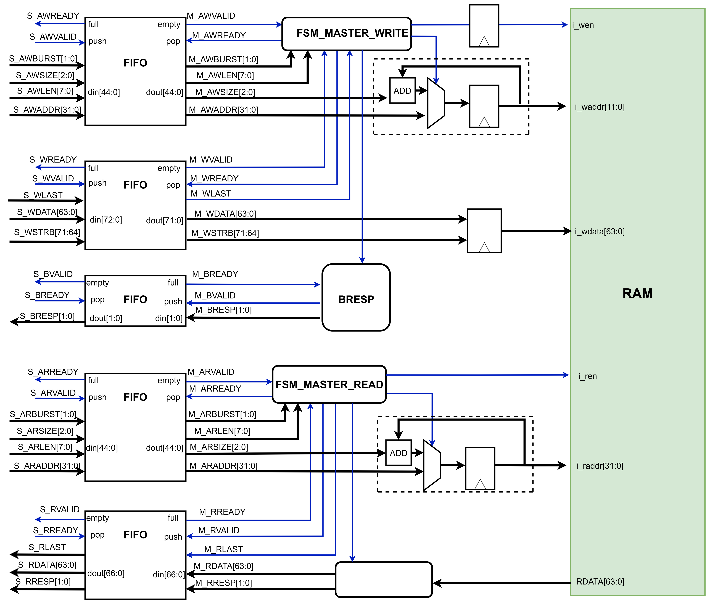
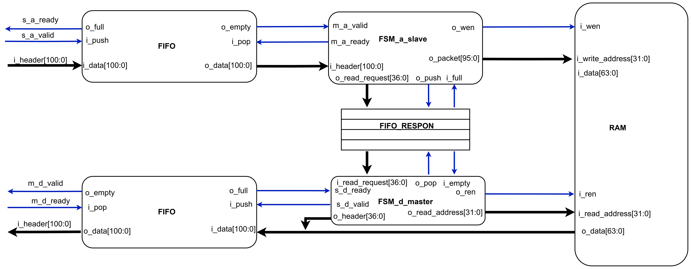

# BUS ARCHITECTURE SUITE
Bus Architecture Suite is a modular and extensible collection of RAM modules designed to support widely used bus protocols in SoC and FPGA designs. It currently features:
* **AXI4 Full RAM** – A fully compliant AXI4 memory-mapped RAM module that supports burst transactions, write strobes, and backpressure.
* **TileLink RAM** – A lightweight TileLink-compatible RAM slave designed for basic simulation and system integration.
 
This repository serves as a foundational framework for developing bus-connected peripherals, protocol bridges, and verification infrastructure. Planned extensions include support for AHB, APB, and cross-protocol adapters such as AXI ↔ APB bridges and TileLink ↔ AXI bridges.  
## AXI Full Master Interface with Synchronous RAM
This module implements a fully functional AXI Master interface that connects to a synchronous RAM. It supports AXI4 full protocol with burst transfers, separate read and write paths, and response handling. The design includes FIFOs to decouple the slave interface from the master logic and uses FSMs for managing write and read operations.

### Architecture Overview

| **Module**         | **Function**                                                                                                                                  |
| ------------------ | --------------------------------------------------------------------------------------------------------------------------------------------- |
| FIFO             | Buffers for each AXI channel (AW, W, B, AR, R) to decouple input AXI transactions from memory-side latency. Supports `push/pop/empty/full`.   |
| FSM_MASTER_WRITE | Finite State Machine to control the write address/data process. Pops from AW and W FIFOs, handles bursts, and generates write signals to RAM. |
| FSM_MASTER_READ  | FSM for read transactions. Pops from AR FIFO, manages burst reads, and triggers RAM read with proper burst addressing.                        |
| BRESP            | Collects write response signals from RAM and pushes to B FIFO for returning AXI `BVALID` + `BRESP`.                                           |
| DECODE_ADDR      | Used in both FSMs to calculate burst addresses based on initial address and incrementing offset (`+size`) per beat.                           |
| `i_waddr/i_raddr`  | Address bus going to RAM, driven by burst logic from FSMs.                                                                                    |
| `i_wdata/i_rdata`  | Data bus for writing to or reading from RAM.                                                                                                  |
| RAM              | Synchronous RAM with separate `i_ren` and `i_wen` signals. The memory is shared by both read/write logic through time-multiplexing.           |

### Supported AXI Channels 
  * **Write Address (AW):** Pushed into FIFO on valid handshake; popped by FSM_MASTER_WRITE.  
  * **Write Data (W):** Pushed into FIFO; each beat includes WDATA, WSTRB, WLAST.  
  * **Write Response (B):** Generated after full write burst completion and pushed to FIFO.  
  * **Read Address (AR):** Buffered into FIFO; FSM_MASTER_READ fetches and drives read bursts.  
  * **Read Data (R):** After reading from RAM, data is pushed into FIFO with RVALID, RRESP, and RLAST.  

### Design Overview
* **Burst Support:** FSM_MASTER_WRITE and FSM_MASTER_READ both calculate burst addresses using adders, support for AXBURST, AXLEN, and AXSIZE.  
* **Throughput-Oriented:** FIFO buffers reduce stalls and decouple AXI transaction timing from memory access timing.  
* **Modular FSMs:** Cleanly separated FSMs allow for easy extension (e.g., cache support or memory-mapped peripherals).  
* **Synchronous RAM:** Ensures timing consistency with the master clock domain.  

## TileLink Slave Interface with Synchronous RAM
This module implements a simplified TileLink slave that interfaces with a synchronous RAM. It handles A (request) and D (response) channels via FSM-based control logic and FIFO buffering. The design decouples TileLink handshakes from RAM access latency, allowing efficient and pipelined memory communication.  

### Architecture Overview

| **Module**           | **Function**                                                                                                                           |
| -------------------- | -------------------------------------------------------------------------------------------------------------------------------------- |
| FIFO (A channel)     | Buffers TileLink `A` channel requests. Stores headers with address and opcode.                                                         |
| FSM_a_slave          | State machine to decode `A` channel packets. Issues write operations directly or creates read requests for later response.             |
| FIFO_RESPON          | A shared buffer holding pending read requests from `A` channel to be processed by the `D` response logic.                              |
| FSM_d_master         | State machine that drives the `D` response channel. Processes read requests from FIFO, issues read to RAM, and sends response packets. |
| FIFO (D channel)     | Buffers outgoing `D` responses. Helps isolate timing between RAM response and TileLink handshaking.                                    |
| RAM                  | Synchronous memory block. Receives write requests from `FSM_a_slave` and read requests from `FSM_d_master`.                            |

### TileLink Channel Handling
**A Channel:**
* Signals: s_a_valid, s_a_ready
* Header width: 101 bits
* Buffered in FIFO; decoded by FSM_a_slave.
* Supports both read and write requests.

**D Channel:**
* Signals: m_d_valid, m_d_ready
* Response packet prepared by FSM_d_master after reading from RAM.
* Header width: 64 bits, formatted into TileLink D packet structure.

### Design Overview
* **TileLink-Compatible:** Decoupled processing of A and D channels with correct ready/valid signaling.
* **FIFO-Based Buffering:** Absorbs burst or back-to-back requests while RAM access is ongoing.
* **Modular FSM Design:** Separates write and read handling, improving clarity and testability.
* **Synchronous RAM Support:** Clean integration with clocked RAMs, suitable for ASIC or FPGA use.

## Summary
* This repository is the result of a personal exploration into on-chip bus protocols and memory-mapped system design. Motivated by a desire to deeply understand how real-world SoC buses operate, I independently designed and implemented RAM modules compatible with AXI4-Full, TileLink, and APB protocols.
* Each module adheres to the core principles of its respective protocol, supports essential features like burst transfers and byte strobes, and is written in clean, modular Verilog. All designs were verified via custom testbenches and waveform inspection, without relying on third-party IPs or automation tools.
This project was not developed under the scope of any university assignment or company task. It was initiated out of personal curiosity and a strong desire to understand system-level hardware design. The experience helped me build practical skills in AXI protocol implementation and served as a foundational step in my long-term plan to specialize in digital design and verification.
